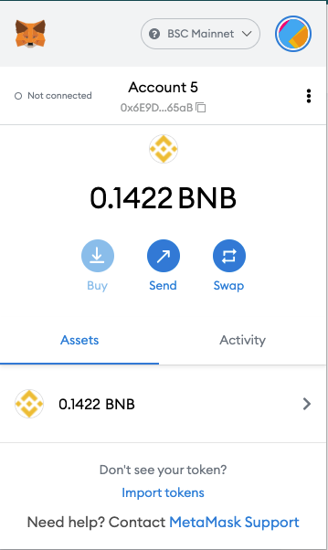
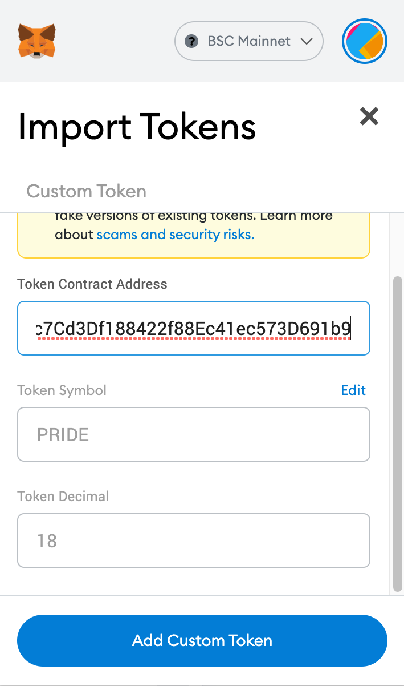
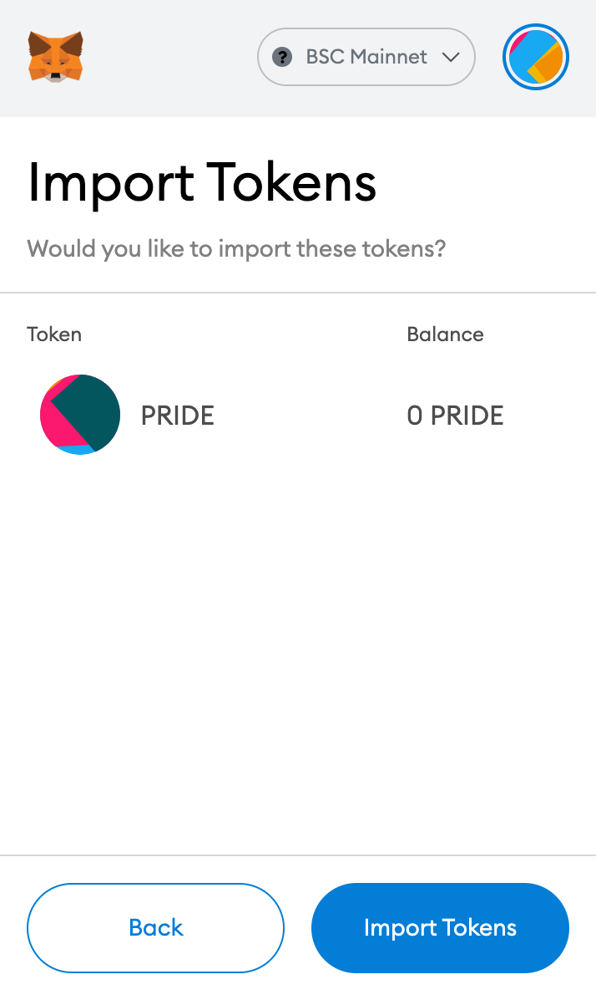
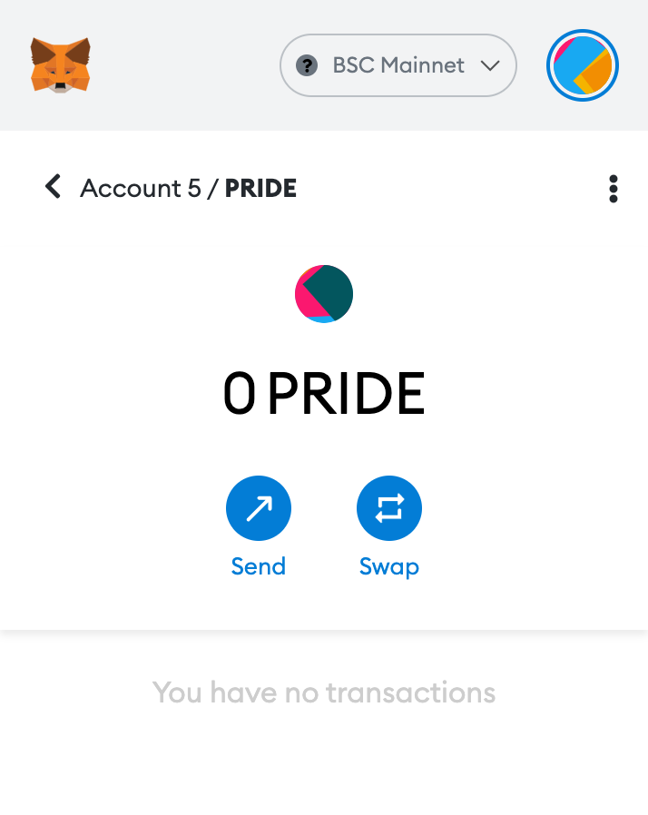
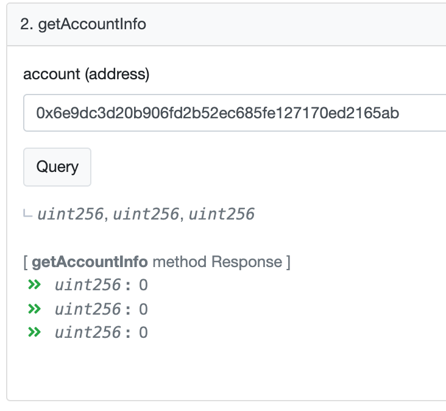
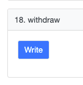

# User's Manual

### Table of contents

* [Managing tokens](#managing-tokens)
* [Vesting](#vesting)
* [Balance](#balance)
* [Withdrawal](#withdrawal)

## Managing tokens
To add tokens to your wallet, you need the following information:
* Token Contract Address - **[0x085d15db9c7cd3df188422f88ec41ec573d691b9](https://bscscan.com/token/0x085d15db9c7cd3df188422f88ec41ec573d691b9)**
* Token Symbol — **PRIDE**
* Decimals — **18**
1. Open your MetaMask wallet, navigate to "Assets" tab and click "Add Token" button.
    

Click to see screenshot

    

    
 

2. Fill in the field `Token Contract Address`. Metamask will fill in the `Token Symbol` and the `Token Decimals` for you.
    

Click to see screenshot

   

    
 

3. Click `Add Tokens` on the next screen.
    

Click to see screenshot

   

    
 

4. You can now monitor your PRIDE balance and transfer tokens directly from MetaMask.
    

Click to see screenshot

   

    
 

## AccountInfo
[VestingWallet](https://bscscan.com/address/#code) has the method called `getAccountInfo` to make it easier for the user to obtain information on the vested amount.  

Click to see screenshot

 

1. Enter your address in the `account` field
2. Click the `Query` button
3. Method returns three values:
   * the initial number of tokens locked on this contract
   * the number of tokens withdrawn
   * the number of tokens available for withdrawal at the moment

## Withdrawal
In order to receive vested tokens, You need to call the `withdraw` method of the [VestingWallet](https://bscscan.com/address/0xA8d3eEF1ca4f3eFB7289B19E31885a149B211Bd7#code) smart contract.
1. Go to the [Write Contract](https://bscscan.com/address/0xA8d3eEF1ca4f3eFB7289B19E31885a149B211Bd7#writeContract) tab of the smart contract.
2. Click `Connect to Web3` button to be able to call the smart contract methods using the bscscan interface.
3. Scroll down to the `withdraw` section.
    

Click to see screenshot

   

    
 
4. Click `Write` button
> Attention! If the conditions for withdrawing funds are not met (for example, you are trying to withdraw tokens too early, or there are no tokens on your balance, Metamask will display a warning: "Transaction Error. Exception thrown in contract code."
> This means that the transaction will fail and there is no point in calling it. Please clarify the vesting conditions and wait until your tokens are available for withdrawal.
